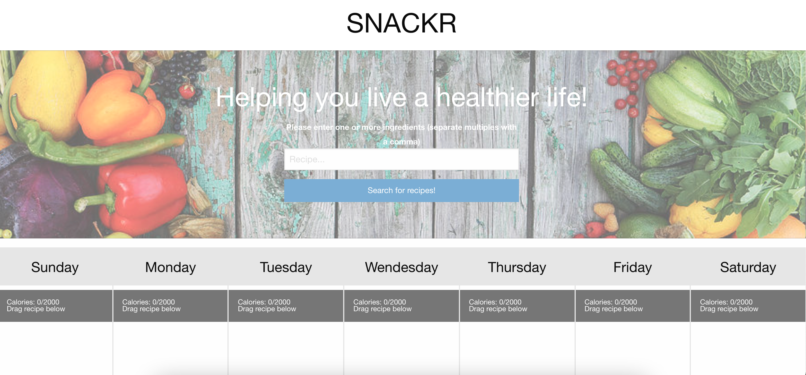

# SNACKR

## Purpose

SNACKR allows you to search for recipes using the ingredients you have in your pantry and then plan out when in the week you'd like to eat them.  It also gives the user some encouragement with motivational quotes from well-regarded thinkers.

## Table of Contents
- [Built With](#built-with)
- [Website](#website)
- [Installation](#installation)
- [Usage](#usage)
- [Contribution](#contribution)
- [License](#license)

## Built With

* HTML
* CSS
* JavaScript
* Font Awesome 4 (https://fontawesome.com/v4.7/)
* Pure.css (https://purecss.io/)
* Materialize.css (https://materializecss.com/)
* Moment.js

## Website

https://nsvoboda.github.io/SNACKR/

### Installation

It is best practice to directly clone the respository by using the following code in your Terminal/Command Line:

git clone git@github.com:nsvoboda/SNACKR.git

You can also download the files into a .zip directly from the GitHub repository: https://github.com/nsvoboda/SNACKR

### Usage

// What is the usage

## Contribution
Edited by Amari, Sara, Robert, and Nate

## License

&copy; 2022 The SNACKR Crew

Licensed under the [BSD 2-Clause](LICENSE.txt)